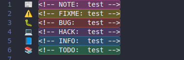

# Comments Highlight

A VSCode extension to highlight comments in different colors based on custom configurations. It supports multiple comment styles and allows you to customize how each type of comment is highlighted.


## Features

- Highlights comments based on customizable prefixes (e.g., `NOTE:`, `HACK:`, `BUG:`).
- Supports various comment styles including `//`, `#`, and `<!-- -->`.
- Configurable background color, text color, border, and prefix icon for each type of comment.
- Option to highlight the entire line or just the comment text.


## Configuration

Add the following configuration to your `settings.json` file to customize the extension:

```json
"commentsHighlight": {
  "fullLine": false,
  "configurations": [
    {
      "text": "NOTE:",
      "backgroundColor": "#ffeb3b",
      "color": "#000000",
      "border": "1px solid #fdd835",
      "borderRadius": "3px",
      "prefixicon": "💡"
    },
    {
      "text": "HACK:",
      "backgroundColor": "#ff5722",
      "color": "#ffffff",
      "border": "1px solid #d84315",
      "borderRadius": "3px",
      "prefixicon": "🔧"
    },
    {
      "text": "BUG:",
      "backgroundColor": "#f44336",
      "color": "#ffffff",
      "border": "1px solid #c62828",
      "borderRadius": "3px",
      "prefixicon": "🐛"
    }
  ]
}
